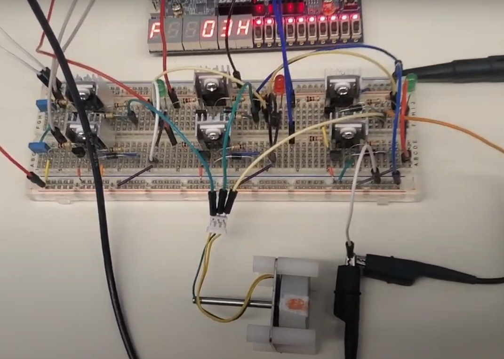

# BLDC Motor Driver 

This project was made for the course EECS3216 at York University. Here we implemented a BLDC motor driver using the SVPWM algorithm implemented in Verilog, and intended for the DE10-Lite.
We implemented our own circuit driver for a BLDC motor, controlling it using the DE10-Lite FPGA.

- This repository contains a runnable project that can be compiled using the Quartus Prime editor. The main file is Driver.sv, note that we did not upload the simulation files, as those would be too large.

- Outputs of the module are Arduino Pins D0-D5, note that the output is inverted! Extra circuitry had to be implemented  on the input to level up the logic level of the FPGA (3.3V).

- The video demonstration of the project can be seen in the following link https://www.youtube.com/watch?si=b8xfoCtHZS__AAA1&v=ajDVEePGOGo&feature=youtu.be.

# Video Demo

# Documentation
- The proposal report of the project can be found here [Proposal Report](./EECS%203216%20Proposal.pdf). It contains the initial idea, hardware design and control models.
- The final report of the project can be found here [Final Report](./EECS%203216%20Project%20Report.pdf). It contains the final digital design, software/algorithm explanation, hardware design, schematic, control model corrections, simulations and additional hardware footage.

## 🛠️ Technologies & Tools

  

- Developed a custom Digital Design for the motor driver circuit using **System Verilog**
- Edited and compiled in **Quartus Prime**

## 🧱 Hardware Platform
- 🔌 **FPGA:** This project uses the [DE10-Lite FPGA development board](https://www.terasic.com.tw/cgi-bin/page/archive.pl?Language=English&CategoryNo=205&No=1046) by [Terasic Technologies](https://www.terasic.com.tw/).
- ⚙️ **Circuit Driver:** Custom three-phase inverter and control circuit  

## License

